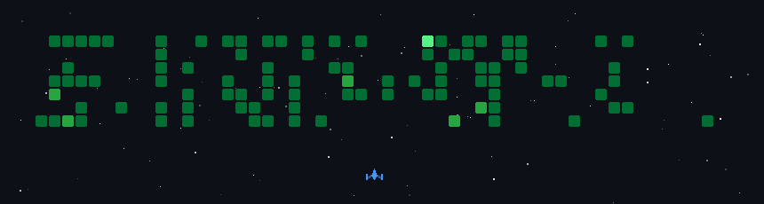

<!-- Waving Banner Header -->

<h1 align="center">Hi there, I'm Chayan </h1>

<!-- Typing Effect -->

  <em>Computer Science Student • ML Practitioner • Full Stack Developer</em>

 

<!-- Social Badges -->

 

<!--  -->

---

## 🚀 About Me

🎓 **Education:** B.Tech in Computer Science @ Adamas University
💼 **Specialization:** Computer Vision + Full Stack Development  
💬 **Ask me about:** Python, Computer Vision, and Backend Logic  

 

---

## 🛠️ Languages and Tools

### Languages & Frameworks

  

### ML / CV Stack

  

### Databases & Cloud

  

### Tools

  

---

## 🌟 Featured Projects

<table>
<tr>
<td width="50%">

### 🔍 Low-Light Object Detection
Real-time object detection pipeline optimized for dark/low-visibility environments

**Tech:** Python, OpenCV, PyTorch, YOLOv8

</td>
<td width="50%">

### 💧 Quantum Watermarking
Quantum-inspired digital image watermarking using CCNOT gates via Qiskit

**Tech:** Python, Qiskit, NumPy, scikit-image

</td>
</tr>
<tr>
<td width="50%">

### 🎵 Groovo
Desktop music streaming app with standalone authentication service

**Tech:** Flask, pywebview, Python, Render

</td>
<td width="50%">

### 🚀 More coming soon...
Always building, always shipping

</td>
</tr>
</table>

---

## 🎮 GitHub Game: Space Shooter Edition

My contribution graph turned into an epic retro shooter! 🚀

---

## 💭 Developer Wisdom

---

### 🤝 Open to Collaborate

*Always excited to work on innovative projects — especially at the intersection of ML and real-world applications!*

 

**Let's build something amazing together** 🚀

 

